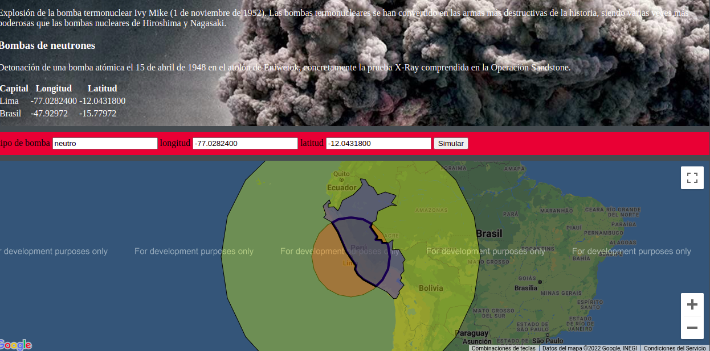
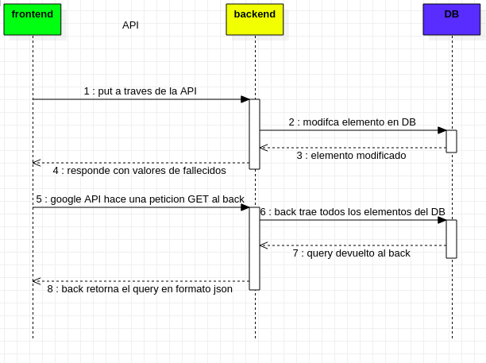

# simulador de bombas
Alcance: Este desarrollo web ayuda a determinar cual seria el impacto en vidas humanas de explotar una bomba dentro o fuera del territorio peruano. 

# funcionamiento alto nivel
## front
Las entradas son:
- solo da un punto geografico
- tipo de bomba
## back
- los calculos los hace el back
## base de datos
- debe tener informacion de contorno de pais o continente
## calculos de funcion
el orden seria el siguiente:
- formula del circulo a partir del punto entregado por el front
- obtener superficie circulo
- realizar interseccion (circulo pais)
- obtener superficie de interseccion
- calculo de cantidad de muertos (superficie intereccion entre superficie pais)

```
 sup. pais      sup. interseccion
------------- = -----------------
# total de h.        # muertos
```
# documentacion
- la forma de comunicacion es a traves de archivos json
- tener en cuenta tambien que el formato es geojson
- django entrega el feature collection completo de la base de datos
- en el back estara toda la infomacion. Si se quiere se ejecutara algo ene le view pero deber terminar el el db
## documentacion de codigo
En el back se comenta el codigo de dos formas. La primera es cuando es informacion neta del programa:
```python
# ========================================================================
# TITULO EN MAYUSCUOLA
# comentario 1
# comentario 2
# ...
# ========================================================================
```
y la segunda es cuando en realidad es codigo comentado temporalemente, como por ejemplo, codigo testing
```python
'''
# TITULO DEL BLOQUE
lo que quieras sin el "#" 
'''
```

## flujo de comunicacion en json
```
+-----+                        +-----+             +-----+ 
|     |        tipo_f          |     |             |     | 
|front|         --->           |back |    --->     |db   | 
|     |         <---           |     |    <---     |     | 
+-----+    tipo_fc / tipo_f    +-----+             +-----+ 
```

- tipo_fc: feature colection completro

```json
{
	"type": "FeatureCollection",
	"features": [

		{
			"type": "Feature",
			"properties": {
				"color": "blue",
				"info": "es otro punto"
			},
			"geometry": {
				"type": "Polygon",
				"coordinates": [
					[
						[10.0, 0.0],
						[8.090169943749475, 5.877852522924732],
						[3.0901699437494745, 9.510565162951535],
						[-3.0901699437494736, 9.510565162951536],
						[-8.090169943749473, 5.877852522924733],
						[-10.0, 1.2246467991473533e-15],
						[-8.090169943749476, -5.87785252292473],
						[-3.0901699437494754, -9.510565162951535],
						[3.0901699437494723, -9.510565162951536],
						[8.090169943749473, -5.877852522924734],
						[10.0, 0.0]
					]
				]
			}
		},

		{
			"type": "Feature",
			"properties": {
				"color": "blue",
				"info": "este dato lo envio front"
			},
			"geometry": {
				"type": "Point",
				"coordinates": [-3.0901699437494736, 9.510565162951536]
			}
		}

	]
}
```

- tipo_f: feature

```json
{
	"type": "Feature",
	"properties": {
		"color": "blue",
		"info": "es otro punto"
	},
	"geometry": {
		"type": "Polygon",
		"coordinates": [
			[
				[10.0, 0.0],
				[8.090169943749475, 5.877852522924732],
				[3.0901699437494745, 9.510565162951535],
				[-3.0901699437494736, 9.510565162951536],
				[-8.090169943749473, 5.877852522924733],
				[-10.0, 1.2246467991473533e-15],
				[-8.090169943749476, -5.87785252292473],
				[-3.0901699437494754, -9.510565162951535],
				[3.0901699437494723, -9.510565162951536],
				[8.090169943749473, -5.877852522924734],
				[10.0, 0.0]
			]
		]
	}
}   
```
### tipos de properties
```json
"properties": {
		"color": "blue",               <->
		"info": "es otro punto",       <->
		"mensaje":"para señalizacion", <-
		"bomba": "tipo de bomba",       ->
		"muertos": 1234                <-
	},
```
(buscar la referencia oficial de la estructura geojson)
## comunicacion API entre el frontend y el backend

### funciones del frontend
Son _postapi()_, _getapi()_ y _putapi()_
- __input__: Todas reciben el url de donde van a consumir la API
  - _post y put_: a parte del url tambien hay que entregarle un dato de tipo _FormData_ que contiene la informacion a enviar al backend.
- __output__: todas retorna un dato tipo [object](https://www.w3schools.com/js/js_objects.asp) que contiene el json que devolvio el back como respuesta. 

### funciones del backend
Tener en cuenta que las funciones del backend actuan cuando les llega un request del front. Estas son: _get()_, _post()_, _put()_ y _delete()_ 
- __input__: reciben _request_. En _request.body_ se encuentra el json entregado por el back en formato binario (_<class 'bytes'>_).
- __output__: Todas devuelven _JsonResponse(respuesta)_ que es de tipo _<class 'django.http.response.JsonResponse'>_. _respuesta_ es un diccionario Python.
# desplegar proyecto
Descargar el repositorio y seguir los siguientes pasos:
```bash
cd (carpeta proyecto)/simulador-de-bombas/backend
python3 -m venv ./env
source (carpeta proyecto)/simulador-de-bombas/backend/env/bin activate
pip3 install -r requirements.txt
cd (carpeta proyecto)/simulador-de-bombas/backend/proyecto
python3 manage.py runserver
```
abrir _put.html_ e interactuar con el el app.

# estructura del proyecto
```
|-- simulador-de-bombas
    |-- flujo.mdj (flujo en UML)
    |-- flujo.png (imagen del flujo)
    |-- demo.png (demostracion del proyecto)
	|-- README.md (documentacion)
	|-- frontend
        |-- api_rest.js (definicion de funciones get, post para comunicacion con URL para la API)
        |-- google_api.js (codigo para mostrar la informacion de la bd en el front)
	|-- backend
        |-- requirements.txt
		|-- env
        |-- proyecto
            |-- aplicacion
	            |-- calculation.py (modulo creado por nosotros)
	
```

# referencia 
- Metodo fetch (oficial) - [link](https://developer.mozilla.org/en-US/docs/Web/API/fetch)
- KML de paises del mundo - [link](https://laprovence.carto.com/tables/world_country_borders_kml/public/map)
- google map (oficial) - [link](https://developers.google.com/)
  - buscar “Maps Platform”
  - ir a SDK de Maps y dar click a “JS”
  - ir “Samples”
  - luego a “Layers”
  -  finalmente “Data Layer: Styling”
- Referencia de GeoJson (oficial) - [link](https://datatracker.ietf.org/doc/html/rfc7946#section-3.1.5)
